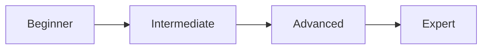

# Bắt đầu với AWS Security Hub


> **Note**: For Vietnamese version, see [README.vi.md](README.vi.md)

## 📑 Table of Contents

- [Introduction](#introduction)
- [Architecture](#architecture)
- [Prerequisites](#prerequisites)
- [Quick Start](#quick-start)
- [Workshop Content](#workshop-content)
- [AWS Well-Architected Framework](#aws-well-architected-framework)
- [Security Best Practices](#security-best-practices)
- [Deployment Options](#deployment-options)
- [Testing & Validation](#testing--validation)
- [Monitoring & Observability](#monitoring--observability)
- [Cleanup](#cleanup)
- [Troubleshooting](#troubleshooting)
- [FAQ](#faq)
- [Cost Estimation](#cost-estimation)
- [Related Workshops](#related-workshops)
- [Contributing](#contributing)
- [License](#license)

---

## 📖 Introduction

This hands-on workshop guides you through AWS services and best practices. You'll learn to build, deploy, and manage AWS infrastructure following the AWS Well-Architected Framework.

**What you'll learn:**
- Core AWS services and concepts
- AWS best practices and design patterns
- Security and compliance fundamentals
- Infrastructure as Code (IaC) deployment
- Monitoring and operational excellence

**Who is this for:**
- Cloud engineers and developers
- DevOps professionals
- IT administrators transitioning to AWS
- Anyone interested in AWS technologies

## 🏗️ Architecture

This workshop implements AWS architecture with the following components:

```
┌─────────────────────────────────────────────────────────────┐
│                        AWS Cloud                             │
│  ┌──────────────┐      ┌──────────────┐      ┌───────────┐ │
│  │   Users      │─────>│  Services    │─────>│  Storage  │ │
│  └──────────────┘      └──────────────┘      └───────────┘ │
└─────────────────────────────────────────────────────────────┘
```

> **Note**: See detailed architecture diagrams in workshop content

## 📋 Prerequisites

### AWS Account Requirements
- Active AWS account with billing enabled
- Root account MFA enabled (recommended)
- IAM user with administrator access for workshop
- AWS CLI v2.x installed and configured

### Technical Skills
- Basic understanding of cloud computing concepts
- Familiarity with command line interface
- Basic knowledge of networking (TCP/IP, DNS, HTTP/HTTPS)
- Programming basics (for automation scripts)

### Required Software
```bash
# AWS CLI
aws --version  # Should be v2.x

# Git
git --version

# Hugo (for workshop content)
hugo version

# Python (if needed)
python3 --version  # Should be 3.8+
```

## 🚀 Quick Start

### Step 1: Clone Repository
```bash
git clone https://gitlab.com/awsfirstcloudjourney/000018-SecurityHub.git
cd 000018-SecurityHub
```

### Step 2: Configure AWS CLI
```bash
aws configure
# Enter your AWS Access Key ID
# Enter your AWS Secret Access Key
# Enter default region (e.g., us-east-1)
# Enter default output format (json)
```

### Step 3: Run Workshop Locally
```bash
# Start Hugo server
hugo server -D

# Open browser
open http://localhost:1313
```

### Step 4: Follow Workshop
1. Read each step carefully
2. Execute hands-on exercises
3. Verify results after each step
4. Clean up resources when complete

## 📚 Workshop Content

Detailed workshop content is available through Hugo server. Topics covered:

1. **Introduction & Setup**
   - Workshop overview
   - Environment preparation
   - AWS account setup

2. **Main Content**
   - Core concepts and theory
   - Hands-on exercises
   - Real-world scenarios

3. **Advanced Topics**
   - Best practices
   - Optimization techniques
   - Production considerations

4. **Conclusion**
   - Key takeaways
   - Next steps
   - Additional resources

## 🏛️ AWS Well-Architected Framework

This workshop aligns with [AWS Well-Architected Framework](https://aws.amazon.com/architecture/well-architected/):

### Security
✅ IAM roles and policies with least privilege
✅ Encryption at rest and in transit
✅ Network security with Security Groups and NACLs
✅ Audit and compliance with CloudTrail

### Reliability
✅ Multi-AZ deployment when applicable
✅ Automated backups and disaster recovery
✅ Monitoring and alerting
✅ Self-healing with Auto Scaling

### Performance Efficiency
✅ Right-sized compute resources
✅ Monitoring with CloudWatch
✅ Caching strategies
✅ Load balancing and distribution

### Cost Optimization
✅ Right-sizing resources
✅ Utilizing Free Tier when possible
✅ Reserved Instances for production
✅ Cost monitoring and budgets

### Operational Excellence
✅ Infrastructure as Code (CloudFormation/CDK)
✅ Automated deployment pipelines
✅ Comprehensive logging
✅ Regular testing and updates

### Sustainability
✅ Resource efficiency
✅ Carbon footprint awareness
✅ Sustainable architecture patterns

## 🔒 Security Best Practices

### IAM & Access Management
```bash
# Create IAM role with least privilege
aws iam create-role --role-name WorkshopRole \
  --assume-role-policy-document file://trust-policy.json

# Attach managed policies
aws iam attach-role-policy --role-name WorkshopRole \
  --policy-arn arn:aws:iam::aws:policy/ReadOnlyAccess
```

### Encryption
- **At Rest**: Enable encryption for all storage services
- **In Transit**: Use HTTPS/TLS for all communications
- **KMS**: Manage encryption keys with AWS KMS

### Network Security
- Configure Security Groups with minimal ingress rules
- Use NACLs for subnet-level protection
- Enable VPC Flow Logs for traffic analysis
- Implement WAF for application protection

### Compliance & Auditing
- Enable CloudTrail for API call auditing
- Use Config to track configuration changes
- Regular security assessments with Security Hub
- Compliance validation with AWS Artifact

## 🚀 Deployment Options

### Option 1: AWS Console (Manual)
Suitable for learning and testing
1. Log in to AWS Console
2. Navigate to service
3. Follow step-by-step guide
4. Verify deployment

### Option 2: AWS CLI
Automate deployment with scripts
```bash
# Configure AWS CLI
aws configure

# Run deployment commands
./deploy.sh
```

### Option 3: CloudFormation
Infrastructure as Code for production
```bash
# Deploy CloudFormation stack
aws cloudformation create-stack \
  --stack-name workshop-stack \
  --template-body file://template.yaml \
  --capabilities CAPABILITY_IAM

# Monitor stack creation
aws cloudformation describe-stacks \
  --stack-name workshop-stack
```

### Option 4: AWS CDK
Modern IaC with programming languages
```bash
# Install CDK
npm install -g aws-cdk

# Bootstrap CDK
cdk bootstrap

# Deploy CDK app
cdk deploy
```

## 🧪 Testing & Validation

### Pre-deployment Testing
```bash
# Validate CloudFormation template
aws cloudformation validate-template \
  --template-body file://template.yaml

# Test IAM policies
aws iam simulate-principal-policy \
  --policy-source-arn arn:aws:iam::123456789012:role/WorkshopRole \
  --action-names s3:GetObject
```

### Post-deployment Validation
```bash
# Check resource status
aws <service> describe-<resource>

# Verify security groups
aws ec2 describe-security-groups --group-ids sg-xxxxx

# Test application endpoint
curl https://your-app-endpoint.com/health
```

### Validation Checklist
- [ ] All resources deployed successfully
- [ ] Services functioning as expected
- [ ] Security groups and IAM policies correct
- [ ] Monitoring and logging enabled
- [ ] Cost tracking configured

## 📈 Monitoring & Observability

### CloudWatch Metrics
```bash
# View metrics
aws cloudwatch get-metric-statistics \
  --namespace AWS/<Service> \
  --metric-name <MetricName> \
  --start-time 2024-01-01T00:00:00Z \
  --end-time 2024-01-01T23:59:59Z \
  --period 3600 \
  --statistics Average
```

### CloudWatch Logs
```bash
# Query logs
aws logs filter-log-events \
  --log-group-name /aws/<service> \
  --filter-pattern "ERROR"
```

### X-Ray Tracing
```bash
# Get trace summaries
aws xray get-trace-summaries \
  --start-time $(date -u -d '1 hour ago' +%s) \
  --end-time $(date -u +%s)
```

### Alerting
```bash
# Create CloudWatch alarm
aws cloudwatch put-metric-alarm \
  --alarm-name high-cpu \
  --alarm-description "Alert when CPU > 80%" \
  --metric-name CPUUtilization \
  --namespace AWS/EC2 \
  --statistic Average \
  --period 300 \
  --threshold 80 \
  --comparison-operator GreaterThanThreshold
```

## 🧹 Cleanup

**⚠️ IMPORTANT**: Always clean up resources after completion to avoid charges!

### Cleanup Steps
```bash
# 1. Delete resources in reverse order
aws <service> delete-<resource> --<resource>-id <id>

# 2. Verify deletion
aws <service> list-<resources>

# 3. Delete S3 buckets
aws s3 rb s3://<bucket-name> --force

# 4. Delete CloudFormation stack
aws cloudformation delete-stack --stack-name <stack-name>
```

### Cleanup Checklist
- [ ] Compute resources (EC2, Lambda, ECS)
- [ ] Databases (RDS, DynamoDB)
- [ ] Storage (S3, EBS, EFS)
- [ ] Networking (VPC, subnets, security groups)
- [ ] IAM roles and policies
- [ ] CloudWatch logs and alarms
- [ ] Billing alerts verified

## 🔧 Troubleshooting

### Common Issues

#### Issue 1: Permission Denied
```
Error: User is not authorized to perform action
```
**Solution**: Check IAM permissions
```bash
aws iam get-user
aws iam list-attached-user-policies --user-name <username>
```

#### Issue 2: Resource Already Exists
```
Error: Resource already exists
```
**Solution**: Check and delete old resource or use different name
```bash
aws <service> describe-<resource> --<resource>-name <name>
```

#### Issue 3: Quota Exceeded
```
Error: You have exceeded the maximum number of resources
```
**Solution**: Request quota increase or delete unused resources
```bash
aws service-quotas get-service-quota --service-code <code> --quota-code <code>
```

### Debug Commands
```bash
# CloudWatch Logs
aws logs tail /aws/<service> --follow

# CloudTrail Events
aws cloudtrail lookup-events --lookup-attributes AttributeKey=EventName,AttributeValue=<event>

# Systems Manager Session
aws ssm start-session --target <instance-id>
```

### Getting Help
- [AWS Support Center](https://console.aws.amazon.com/support/)
- [AWS Forums](https://forums.aws.amazon.com/)
- [Stack Overflow - AWS Tag](https://stackoverflow.com/questions/tagged/amazon-web-services)
- [AWS re:Post](https://repost.aws/)

## ❓ FAQ

### Is this workshop free?
Many AWS services offer Free Tier. However, some resources may incur costs. See [Cost Estimation](#cost-estimation) section for details.

### How long does this workshop take?
Estimated time: 1-2 hours. Actual time may vary based on experience level.

### What experience do I need?
See [Prerequisites](#prerequisites) section for required knowledge and skills.

### Can I run this workshop multiple times?
Yes! Remember to clean up resources after each run to avoid conflicts and costs.

### Is there a certificate for completion?
This is self-paced learning material. For AWS certifications, you need to take official AWS exams.

### I'm getting errors, what should I do?
See [Troubleshooting](#troubleshooting) section or contact [community](#getting-help).

## 💰 Cost Estimation

### AWS Free Tier
Many services in this workshop can use AWS Free Tier:

- **EC2**: 750 hours/month t2.micro (first 12 months)
- **S3**: 5GB storage, 20,000 GET, 2,000 PUT requests
- **Lambda**: 1 million requests/month, 400,000 GB-seconds
- **DynamoDB**: 25GB storage, 25 read/write capacity units

### Estimated Costs (if exceeding Free Tier)

| Service | Configuration | Estimated Cost/Month |
|---------|--------------|---------------------|
| Compute | Small instances | $10-50 |
| Database | Development tier | $15-30 |
| Storage | <100GB | $3-10 |
| Networking | Standard transfer | $5-15 |

> **Note**: Actual costs may vary by region and usage pattern.

### Cost Savings Tips
1. ✅ Clean up resources immediately after completion
2. ✅ Use Free Tier when possible
3. ✅ Set up billing alerts
4. ✅ Choose appropriate instance sizes
5. ✅ Enable cost optimization features

### Cost Monitoring
```bash
# AWS Cost Explorer
aws ce get-cost-and-usage \
  --time-period Start=2024-01-01,End=2024-01-31 \
  --granularity MONTHLY \
  --metrics BlendedCost

# Set billing alarm
aws cloudwatch put-metric-alarm \
  --alarm-name billing-alarm \
  --alarm-description "Billing exceeded $10" \
  --metric-name EstimatedCharges \
  --namespace AWS/Billing \
  --statistic Maximum \
  --period 21600 \
  --threshold 10 \
  --comparison-operator GreaterThanThreshold
```

## 🔗 Related Workshops

### Security Workshops

Explore more workshops in the same category:
- See [Workshop Index](../README_INDEX.md) for full list
- Filter by category: `Security`
- Sort by difficulty level

### Learning Path



### Recommended Workshops
1. **Beginner**: Workshops 000001-000020
2. **Intermediate**: Workshops 000021-000060
3. **Advanced**: Workshops 000061-000160
4. **Expert**: Workshops 100000+

## 🤝 Contributing

We welcome contributions! Please see [CONTRIBUTING.md](CONTRIBUTING.md) for details on:
- How to submit issues
- How to propose changes
- Code of conduct
- Development guidelines

## 📄 License

This project is licensed under the MIT License - see [LICENSE](LICENSE) file for details.

## 📚 Additional Resources

### AWS Documentation
- [AWS Documentation](https://docs.aws.amazon.com/)
- [AWS Architecture Center](https://aws.amazon.com/architecture/)
- [AWS Well-Architected Framework](https://aws.amazon.com/architecture/well-architected/)
- [AWS Security Best Practices](https://aws.amazon.com/security/best-practices/)

### AWS Training
- [AWS Skill Builder](https://skillbuilder.aws/) - Free digital training
- [AWS Workshops](https://workshops.aws/) - Hands-on workshops
- [AWS Ramp-Up Guides](https://aws.amazon.com/training/ramp-up-guides/)
- [AWS Certification](https://aws.amazon.com/certification/)

### Community
- [AWS re:Post](https://repost.aws/) - Community Q&A
- [AWS Forums](https://forums.aws.amazon.com/)
- [AWS User Groups](https://aws.amazon.com/developer/community/usergroups/)
- [AWS Events](https://aws.amazon.com/events/)

## 📞 Contact

- **Website**: [AWS First Cloud Journey](https://awsfirstcloudjourney.com)
- **GitLab**: [awsfirstcloudjourney](https://gitlab.com/awsfirstcloudjourney)
- **Email**: contact@awsfirstcloudjourney.com

---

<p align="center">
  <i>⭐ If you find this workshop helpful, please star the repository! ⭐</i>
</p>

<p align="center">
  <sub>Built with ❤️ by AWS First Cloud Journey Team</sub>
</p>
