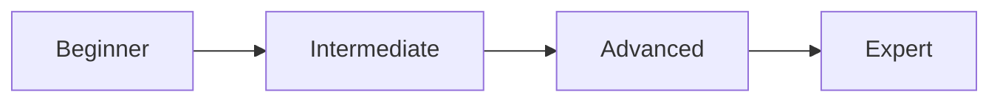

# Bắt đầu với AWS Security Hub


## 📑 Mục Lục

- [Giới thiệu](#giới-thiệu)
- [Kiến trúc](#kiến-trúc)
- [Yêu cầu](#yêu-cầu)
- [Bắt đầu nhanh](#bắt-đầu-nhanh)
- [Nội dung Workshop](#nội-dung-workshop)
- [Kiểm tra & Xác nhận](#kiểm-tra--xác-nhận)
- [Dọn dẹp tài nguyên](#dọn-dẹp-tài-nguyên)
- [Hướng phát triển](#hướng-phát-triển)
- [Troubleshooting](#troubleshooting)
- [FAQ](#faq)
- [Ước tính chi phí](#ước-tính-chi-phí)
- [Workshop liên quan](#workshop-liên-quan)
- [Đóng góp](#đóng-góp)
- [Liên hệ](#liên-hệ)

---

## 📖 Giới Thiệu

**AWS Security** Hub cung cấp cho bạn cái nhìn toàn diện về các cảnh báo bảo mật ưu tiên cao và trạng thái tuân thủ trên các tài khoản AWS.

## 🏗️ Kiến Trúc

Workshop này triển khai kiến trúc AWS với các components chính:

```
┌─────────────────────────────────────────────────────────────┐
│                     AWS Cloud                                │
│  ┌──────────────┐      ┌──────────────┐      ┌───────────┐ │
│  │   Users      │─────>│  Services    │─────>│  Storage  │ │
│  └──────────────┘      └──────────────┘      └───────────┘ │
└─────────────────────────────────────────────────────────────┘
```

> **Lưu ý**: Xem chi tiết trong workshop content

## 📋 Yêu Cầu

- Tài khoản AWS (có thể sử dụng AWS Free Tier)
- Kiến thức cơ bản về AWS
- Trình duyệt web hiện đại

## 🚀 Bắt Đầu Nhanh

### Chuẩn bị

```bash
# Clone repository
git clone https://gitlab.com/awsfirstcloudjourney/000018-SecurityHub.git
cd 000018-SecurityHub

# Cài đặt Hugo (nếu chưa có)
# macOS
brew install hugo

# Ubuntu/Debian
sudo apt-get install hugo

# Windows
choco install hugo
```

### Chạy Workshop Locally

```bash
# Start Hugo server
hugo server -D

# Mở browser
open http://localhost:1313
```

### Làm theo Workshop

1. Đọc kỹ từng bước trong workshop
2. Thực hiện hands-on theo hướng dẫn
3. Kiểm tra kết quả sau mỗi bước
4. Dọn dẹp resources khi hoàn thành

## 📚 Nội Dung Workshop

Chi tiết nội dung xem trong workshop.

## ✅ Kiểm Tra & Xác Nhận

### Kiểm tra sau mỗi bước

```bash
# Kiểm tra resources đã tạo
aws <service> describe-<resource>

# Kiểm tra logs
aws logs tail /aws/<service>/<name> --follow

# Kiểm tra status
aws <service> get-<status>
```

### Validation Checklist

- [ ] Tất cả resources được tạo thành công
- [ ] Services hoạt động đúng như mong đợi
- [ ] Security groups và IAM policies đúng
- [ ] Monitoring và logging được enable
- [ ] Cost tracking được thiết lập

## 🧹 Dọn Dẹp Tài Nguyên

**⚠️ QUAN TRỌNG**: Luôn dọn dẹp resources sau khi hoàn thành để tránh chi phí phát sinh!

### Các bước dọn dẹp

```bash
# 1. Xóa các resources theo thứ tự ngược lại với creation
aws <service> delete-<resource> --<resource>-id <id>

# 2. Kiểm tra lại
aws <service> list-<resources>

# 3. Xóa S3 buckets (nếu có)
aws s3 rb s3://<bucket-name> --force

# 4. Xóa CloudFormation stack (nếu dùng)
aws cloudformation delete-stack --stack-name <stack-name>
```

### Cleanup Checklist

- [ ] Compute resources (EC2, Lambda, ECS, etc.)
- [ ] Databases (RDS, DynamoDB, etc.)
- [ ] Storage (S3, EBS, EFS, etc.)
- [ ] Networking (VPC, subnets, security groups, etc.)
- [ ] IAM roles và policies
- [ ] CloudWatch logs và alarms
- [ ] Billing alerts verified

## 🚀 Hướng Phát Triển

### Các Bước Tiếp Theo

Sau khi hoàn thành workshop này, bạn có thể:

- Implement Zero Trust security model
- Set up Security Hub cho centralized monitoring
- Configure automated compliance checking
- Implement least privilege access
- Set up incident response procedures

### Dịch Vụ Liên Quan

Khám phá các dịch vụ AWS có thể tích hợp:

- **CloudTrail**: Tích hợp để mở rộng chức năng
- **Config**: Tích hợp để mở rộng chức năng
- **Inspector**: Tích hợp để mở rộng chức năng

### Best Practices

- Enable MFA cho tất cả users
- Use IAM Roles instead of access keys
- Regular security audits
- Implement proper logging và monitoring
- Regular credential rotation

### Lộ Trình Học Tập

#### Beginner → Intermediate
1. Hoàn thành workshop cơ bản
2. Thực hành với real-world scenarios
3. Tối ưu hóa và refactor solution

#### Intermediate → Advanced
1. Implement advanced features
2. Performance tuning và optimization
3. Security hardening
4. Production deployment

#### Advanced
1. Multi-region deployment
2. Disaster recovery planning
3. Cost optimization strategies
4. Compliance và governance

### Tài Nguyên Học Tập

- [AWS Documentation](https://docs.aws.amazon.com/)
- [AWS Well-Architected Framework](https://aws.amazon.com/architecture/well-architected/)
- [AWS Workshops](https://workshops.aws/)
- [AWS Skill Builder](https://skillbuilder.aws/)
- [AWS Blog](https://aws.amazon.com/blogs/)

### Chứng Chỉ Liên Quan

- AWS Certified Security - Specialty
- AWS Certified Solutions Architect - Professional

### Community & Support

- [AWS First Cloud Journey Community](https://awsfirstcloudjourney.com)
- [AWS User Groups Vietnam](https://www.meetup.com/pro/aws-user-groups-vietnam/)
- [AWS Support](https://aws.amazon.com/premiumsupport/)
- [Stack Overflow - AWS](https://stackoverflow.com/questions/tagged/amazon-web-services)

## 🔧 Troubleshooting

### Lỗi Thường Gặp

#### Lỗi 1: Permission Denied
```
Error: User is not authorized to perform action
```

**Giải pháp**: Kiểm tra IAM permissions
```bash
aws iam get-user
aws iam list-attached-user-policies --user-name <username>
```

#### Lỗi 2: Resource Already Exists
```
Error: Resource already exists
```

**Giải pháp**: Kiểm tra và xóa resource cũ hoặc dùng tên khác
```bash
aws <service> describe-<resource> --<resource>-name <name>
```

#### Lỗi 3: Quota Exceeded
```
Error: You have exceeded the maximum number of resources
```

**Giải pháp**: Request quota increase hoặc xóa resources không dùng
```bash
aws service-quotas get-service-quota --service-code <code> --quota-code <code>
```

### Debug Commands

```bash
# CloudWatch Logs
aws logs tail /aws/<service> --follow

# CloudTrail Events
aws cloudtrail lookup-events --lookup-attributes AttributeKey=EventName,AttributeValue=<event>

# System Manager Session Manager
aws ssm start-session --target <instance-id>
```

### Nhận Hỗ Trợ

- [AWS Support Center](https://console.aws.amazon.com/support/)
- [AWS Forums](https://forums.aws.amazon.com/)
- [Stack Overflow - AWS Tag](https://stackoverflow.com/questions/tagged/amazon-web-services)

## ❓ FAQ

### Workshop liên quan đến chi phí không?

Một số AWS services có Free Tier. Tuy nhiên, một số resources có thể phát sinh chi phí. Xem section [Ước tính chi phí](#ước-tính-chi-phí) để biết thêm chi tiết.

### Workshop này mất bao lâu để hoàn thành?

Thời gian hoàn thành tùy thuộc vào experience level của bạn. Xem badge ở đầu README để biết estimated time.

### Tôi cần kinh nghiệm gì để làm workshop này?

Xem section [Yêu cầu](#yêu-cầu) để biết prerequisites cần thiết.

### Tôi có thể chạy workshop này nhiều lần không?

Có! Nhớ dọn dẹp resources sau mỗi lần chạy để tránh conflicts và chi phí.

### Workshop này có certificate không?

Workshop này là self-paced learning. Để nhận AWS certifications, bạn cần thi các kỳ thi chính thức của AWS.

### Tôi gặp lỗi, phải làm sao?

Xem section [Troubleshooting](#troubleshooting) hoặc liên hệ qua [Community](#community--support).

## 💰 Ước Tính Chi Phí

### AWS Free Tier

Nhiều services trong workshop có thể sử dụng AWS Free Tier:

- **EC2**: 750 hours/month t2.micro (12 tháng đầu)
- **S3**: 5GB storage, 20,000 GET, 2,000 PUT requests
- **Lambda**: 1 million requests/month, 400,000 GB-seconds
- **DynamoDB**: 25GB storage, 25 read/write capacity units

### Ước Tính Chi Phí (nếu vượt Free Tier)

| Service | Configuration | Estimated Cost/Month |
|---------|--------------|---------------------|
| Compute | Small instances | $10-50 |
| Database | Development tier | $15-30 |
| Storage | <100GB | $3-10 |
| Networking | Standard transfer | $5-15 |

> **Lưu ý**: Chi phí thực tế có thể khác nhau tùy region và usage pattern.

### Tiết Kiệm Chi Phí

1. ✅ Dọn dẹp resources ngay sau khi hoàn thành
2. ✅ Sử dụng Free Tier khi có thể
3. ✅ Set up billing alerts
4. ✅ Chọn instance size phù hợp
5. ✅ Enable cost optimization features

### Theo Dõi Chi Phí

```bash
# AWS Cost Explorer
aws ce get-cost-and-usage --time-period Start=2024-01-01,End=2024-01-31 --granularity MONTHLY --metrics BlendedCost

# Set billing alarm
aws cloudwatch put-metric-alarm --alarm-name billing-alarm --alarm-description "Billing exceeded $10" --metric-name EstimatedCharges --namespace AWS/Billing --statistic Maximum --period 21600 --evaluation-periods 1 --threshold 10 --comparison-operator GreaterThanThreshold
```

## 🔗 Workshop Liên Quan

### Security Workshops

Khám phá thêm các workshops trong cùng category:

- Xem [Workshop Index](../README_INDEX.md) để tìm workshops liên quan
- Filter by category: `Security`
- Sort by difficulty level

### Learning Path



### Workshops Đề Xuất

1. **Beginner**: Workshops 000001-000020
2. **Intermediate**: Workshops 000021-000060
3. **Advanced**: Workshops 000061-000160
4. **Expert**: Workshops 100000+

## 🤝 Đóng Góp

Nếu bạn tìm thấy lỗi hoặc muốn cải thiện workshop, vui lòng:

1. Fork repository
2. Tạo branch mới (`git checkout -b feature/improvement`)
3. Commit thay đổi (`git commit -am 'Add new feature'`)
4. Push lên branch (`git push origin feature/improvement`)
5. Tạo Pull Request

## 📞 Liên Hệ

- **Website**: [AWS First Cloud Journey](https://awsfirstcloudjourney.com)
- **GitLab**: [awsfirstcloudjourney](https://gitlab.com/awsfirstcloudjourney)
- **Email**: contact@awsfirstcloudjourney.com

---

<p align="center">
  <i>⭐ Nếu workshop này hữu ích, hãy star repository! ⭐</i>
</p>

<p align="center">
  <sub>Built with ❤️ by AWS First Cloud Journey Team</sub>
</p>
